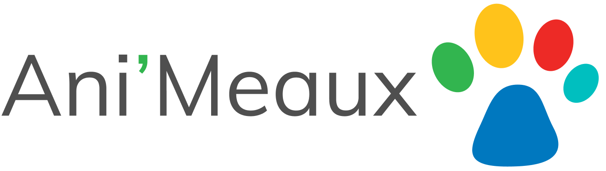

# Ani'Meaux

[](https://github.com/airbnb/javascript)

<a href="https://www.animeaux.org/?utm_source=github&utm_medium=logo" title="Ani'Meaux">
  
</a>

> An animal protection non-profit organization website based in Meaux (near Paris) in France. This repo contains the official website source code (with both frontend & backend).

## Table of Contents

- [Requirements](#requirements)
- [Getting started](#getting-started)
- [Usage](#usage)
- [Contribute](#contribute)
- [License](#license)

## Requirements

To run this project, you may require:

- Docker
- Git

## Getting started

Clone the repo in your machine then run the commands:

``` bash
# Start the project (both backend & frontend)
$ docker-compose up

# Create the database
$ docker-compose run backend bundle exec rake db:create

# Run the migrations
$ docker-compose run backend bundle exec rake db:migrate

# Generate fake data
$ docker-compose run backend bundle exec rake db:seed
```

## Usage

To run the admin panel, access to `http://localhost:3000/admin` and use the ids:

- Email: `admin@example.com`
- Password: `password`

## Contribute

If you want to contribute to the project (new feature, bugfix, ...), follow the contribution guidelines.

## Deployment

See [Deployment](./docs/DEPLOYMENT) for production deploy instructions.

## License

This project is under the **MIT license**. See the [License](./LICENSE) file for more informations.
